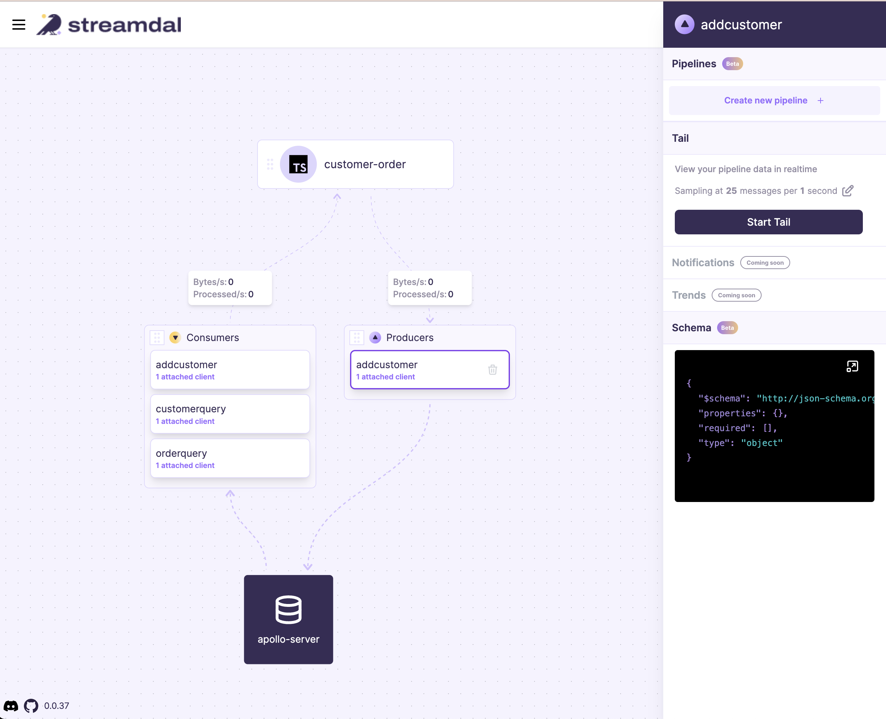

# Example Application using Streamdal's code-native data pipeline plugin for Apollo Server

##### Getting started

You must have the Streamdal platform running. To bring it up locally, you can use docker compose:

`docker compose up`

Alternatively you can deploy it to your environment, see here for details:
```
https://github.com/streamdal/streamdal/tree/main/docs/install
```

Add configuration. You can set configurations via env variables or code. The configuration
variables you provide will point to the Streamdal platform you ran just above.

If your app supports `.env` files:

```
cp example.env .env
```

Or export them:

```
export STREAMDAL_URL="localhost:8082"
export STREAMDAL_TOKEN="1234"
export STREAMDAL_SERVICE_NAME="user-onboard-service"
```

Or via code: see and uncomment configuration code in the example app:

```
./src/index.ts
```

Run the app:

```shell
npm install

npm start
```

This will fire up an example app running the Streamdal Apollo Server plugin. Go to `http://localhost:4000`
and execute some graphql queries in the playground.

After you've run at least one query, go to `http://localhost:8080` and you will see the above operations
were automatically instrumented and you are now able to create and add pipelines
to them.




