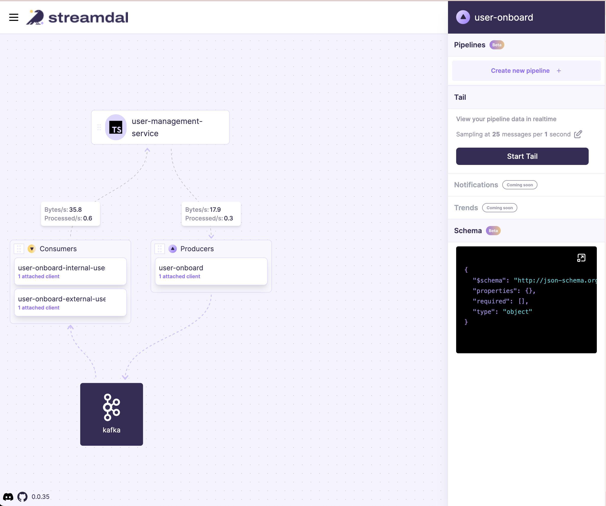

# Example Application using Streamdal's Kafkajs Shim

This is an example application that uses Streamdal's Kafkajs Shim.

##### Getting started

You must have Kafka and the Streamdal Platform running. To run them all locally using docker simply:

```
docker compose up
```


Install dependencies. In `/kafka/kafkajs-shim`:

```
npm install
```

Add configuration. You can set configurations via env variables or code.

If your app supports `.env` files:

```
cp example.env .env
```

Or export them:

```
export STREAMDAL_URL="localhost:8082"
export STREAMDAL_TOKEN="1234"
export STREAMDAL_SERVICE_NAME="user-onboard-service"
```

Or via code: see and uncomment configuration code in `src/index.ts`


##### Run the app
``` 
npm start
```

This will fire up an example Kafka Producer that will send messages to Kafka on 
an interval and a couple Kafka Consumers that will consumer those messages. 

Once running, go to `http://localhost:8080` and you will see the above operations
were automatically instrumented and you are now able to create and add pipelines 
to them.




