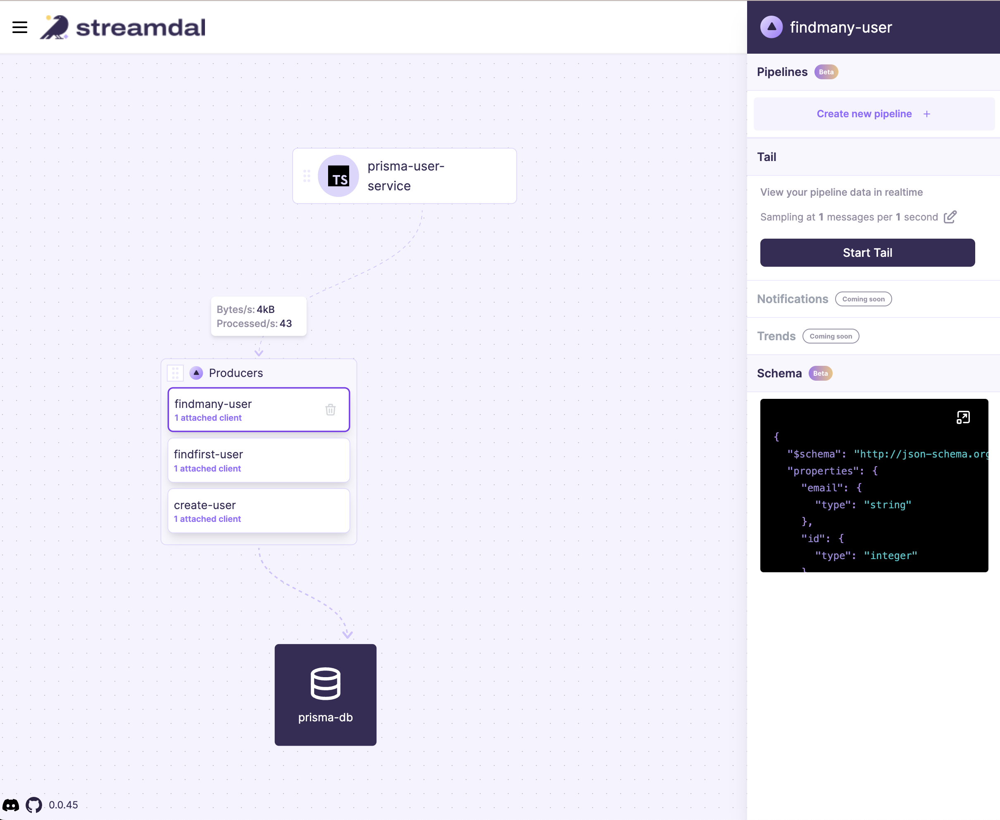

<div align="center">


[](https://github.com/streamdal/prisma-extension-streamdal)
[](https://discord.gg/streamdal)

</div>  

# Streamdal Prisma Client Extension Example Application

### Code native data pipelines for Prisma query operations

This is an example application that uses Streamdal's Prisma Extension to add 
code native data pipelines to observe, transform, and secure data before it 
enters or exists the database. 

Read more about Streamdal here: [Streamdal](https://www.streadmdal.com).
Read more about Prisma client extensions here: [Prisma docs](https://www.prisma.io/docs/concepts/components/prisma-client/client-extensions).

### Prerequisites

### Prerequisites

You must have the Streamdal platform running. To bring it up locally, you can use docker compose:

`docker compose up`

Alternatively you can deploy it to your environment, see here for details:
```
https://github.com/streamdal/streamdal/tree/main/docs/install
```
### Configure

You can configure the extension via env variables or code. The configuration
variables you provide will point to the Streamdal platform you ran just above.

If your app supports `.env` files, add the following there:

```
STREAMDAL_URL="localhost:8082"
STREAMDAL_TOKEN="1234"
STREAMDAL_SERVICE_NAME="prisma-user-service"
STREAMDAL_QUIET=true
```

Or export them:

```
export STREAMDAL_URL="localhost:8082"
export STREAMDAL_TOKEN="1234"
export STREAMDAL_SERVICE_NAME="prisma-user-service"
```

Or via code. See and uncomment configuration code in `index.ts`.

##### Run the Example App

```shell
npm install
npx prisma db push
npm run dev
```

This will fire up an example app running the Streamdal Prisma Extension that inserts and fetches
random users continuously. 

Go to `http://localhost:8080` and you will see the above operations were automatically 
instrumented and you are now able to create and add pipelines to them.




